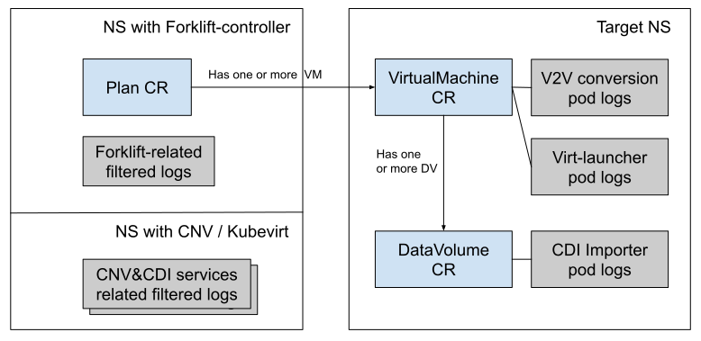

# Forklift must-gather

`must-gather` is a tool built on top of [OpenShift must-gather](https://github.com/openshift/must-gather)
that expands its capabilities to gather Forklift specific resources

## Usage
```sh
oc adm must-gather --image=quay.io/konveyor/forklift-must-gather:latest
```

The command above will create a local directory with a dump of the Forklift state.

You will get a dump of Forklift-related:
- logs
- CRs

## Targeted gathering

To reduce amount of data and time consumed by must-gather, there is a "targeted" version which allows dump only selected resources. It is possible specify namespace (NS), plan (PLAN) or virtual machine name (VM). The archive will only contain CRs relevant for selected resources and filtered set of log files, see more detailed description in following section.

Following targeted gathering parameters are supported:

Namespace

```sh
oc adm must-gather --image=quay.io/konveyor/forklift-must-gather:latest -- NS=ns1 /usr/bin/targeted
```

Plan

```sh
oc adm must-gather --image=quay.io/konveyor/forklift-must-gather:latest -- PLAN=plan1 /usr/bin/targeted
```


VM name together with namespace where the VM belongs to

```sh
oc adm must-gather --image=quay.io/konveyor/forklift-must-gather:latest -- NS=ns1 VM=vm-3345 /usr/bin/targeted
```

### Gathered CRs detailed

Custom Resource | Description, identification field | Selection process for NS | Selection process for Plan | Selection process for VM
--- | --- | --- | --- | ---
Plan | Defines VM, storage and network mapping (```name```) | All Plans with targetNamespace=$NS | Plan with name=$PLAN | -
VirtualMachine | Represents target migrated VM (```name```) | All VMs from all Plans with targetNamespace=$NS | All VMs from given Plan | VM with name=$VM
DataVolume | Represents disk mounted to the migrated VM (```name```) | All DVs of all VMs from all Plans with targetNamespace=$NS | All DVs of all VMs from given Plan | All DVs of given VM

### Gathered Pod logs

Pods in target namespace | Description | Filtering process | Parent object | Example name
--- | --- | --- | --- | ---
Virt-v2v conversion | VM conversion logs  | full for given VMs or VMs from given Plan | VM | ```mig-plan-cold-vm-123```
Virt-launcher | VM launcher logs | full for given VMs or VMs from given Plan | VM | ```virt-launcher-test-2disks-for-cold-123```
Importer | CDI Importer log | full for given VM's DVs | DV | ```importer-mig-plan-cold-vm-123-tkhdz```


Pods in Forklift namespace | Description | Filtering process
--- | --- | ---
(all) | All pods in forklift namespace (e.g. ```forklift-controller```, ```forklift-must-gather-api```, ...) | grep by Plan, VM, DV names


Pods in CDI namespace | Description | Filtering process
--- | --- | ---
(all) | All pods in CDI namespace, filtered logs of containerized disk import components | grep by Plan, VM, DV names

### Targeted gathering objects diagram



### Example targeted archive structure (for PLAN=mig-plan-cold)

```
must-gather/
└── namespaces
    ├── target-vm-ns
    │   ├── crs
    │   │   ├── datavolume
    │   │   │   ├── mig-plan-cold-vm-7595-tkhdz.yaml
    │   │   │   ├── mig-plan-cold-vm-7595-5qvqp.yaml
    │   │   │   └── mig-plan-cold-vm-8325-xccfw.yaml
    │   │   └── virtualmachine
    │   │       ├── test-test-rhel8-2disks2nics.yaml
    │   │       └── test-x2019.yaml
    │   └── logs
    │       ├── importer-mig-plan-cold-vm-7595-tkhdz
    │       │   └── current.log
    │       ├── importer-mig-plan-cold-vm-7595-5qvqp
    │       │   └── current.log
    │       ├── importer-mig-plan-cold-vm-8325-xccfw
    │       │   └── current.log
    │       ├── mig-plan-cold-vm-7595-4glzd
    │       │   └── current.log
    │       └── mig-plan-cold-vm-8325-4zw49
    │           └── current.log
    └── openshift-mtv
        ├── crs
        │   └── plan
        │       └── mig-plan-cold.yaml
        └── logs
            ├── forklift-controller-67656d574-w74md
            │   └── current.log
            └── forklift-must-gather-api-89fc7f4b6-hlwb6
                └── current.log
```

Some objects (pods logs or CRs) might be missing in case of failed migration. Present pods depend on the phase that was reached by the migration pipeline.

Log files which are empty (e.g. no content in pod log or empty result after applying filter) are ommited from the must-gather archive.

## Development
You can build the image locally using the Dockerfile included.

A `Makefile` is also provided. To use it, you must pass a repository via the command-line using the variable `IMAGE_NAME`.
You can also specify the registry using the variable `IMAGE_REGISTRY` (default is [quay.io](https://quay.io)) and the tag via `IMAGE_TAG` (default is `latest`).

The targets for `make` are as follows:
- `build`: builds the image with the supplied name and pushes it
- `docker-build`: builds the image but does not push it
- `docker-push`: pushes an already-built image

For example:
```sh
make build IMAGE_NAME=my-repo/forklift-must-gather
```
would build the local repository as `quay.io/my-repo/forklift-must-gather:latest` and then push it.
